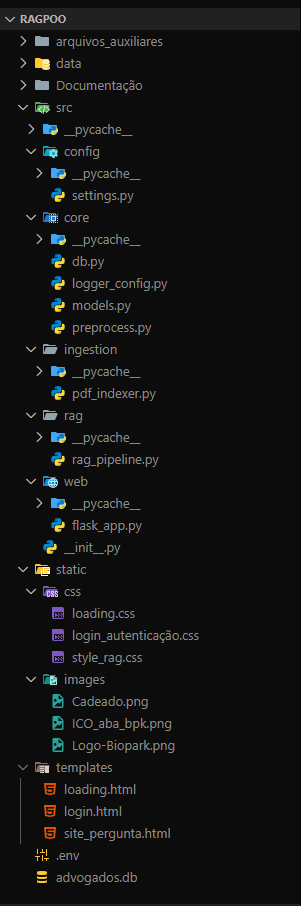

# Sistema Jurídico Inteligente - Estrutura do Projeto

Este documento descreve a estrutura do projeto, explicando o papel de cada arquivo e pasta.

---

## 📁 src

### 📁 core

- **logger_config.py**  
  Configura o logger da aplicação para registrar informações, erros e avisos.

- **preprocess.py**  
  Contém funções para pré-processamento de textos, como normalização, remoção de acentos e caracteres especiais.

- **db.py**  
  Inicializa a conexão com o banco de dados usando SQLAlchemy.

- **models.py**  
  Define os modelos do banco de dados. Atualmente, possui o modelo `Advogado`.

---

### 📁 rag

- **rag_pipeline.py**  
  Implementa a RAG, ou seja, lógica para buscar documentos relevantes e gerar respostas usando LLMs.

---

### 📁 ingestion

- **pdf_indexer.py**  
  Responsável por processar PDFs e indexá-los no vetor store (usado o Pinecone).

---

### 📁 config

- **settings.py**  
  Lê variáveis de ambiente do `.env` e centraliza as configurações da aplicação, como chaves da OpenAI e Pinecone, pasta de PDFs, tamanho dos chunks, etc.

---

### 📁 web

- **flask_app.py**  
  Inicializa a aplicação Flask, define rotas para login, carregamento, chatbot e indexação de PDFs. Conecta a RAG e o PDFIndexer.  

---

## 📁 templates

Contém os arquivos HTML da interface do usuário:

- **login.html** → Tela de login. Faz requisições para a rota `/auth`.
- **loading.html** → Tela de carregamento exibida após o login.
- **site_pergunta.html** → Interface do chatbot, onde o usuário envia perguntas e visualiza respostas e contexto.

---

## 📁 static

Contém arquivos estáticos (CSS, imagens, JS):

- **css/** → Estilos do site.
- **images/** → Logos, ícones e imagens usadas no front-end.
- **js/** → Scripts estão integrados dentro do próprio html respectivo

---

## 📁 arquivos_auxiliares

- **run.py**  
  Script para rodar a aplicação, criando o app Flask chamando `create_app()`.

---

## 📝 .env

Arquivo de configuração com variáveis de ambiente:

- `OPENAI_API_KEY` → Chave da OpenAI.
- `PINECONE_API_KEY` → Chave do Pinecone.
- `PINECONE_ENVIRONMENT` → Região do Pinecone.
- `PINECONE_INDEX_NAME` → Nome do índice no Pinecone.
- `PDF_FOLDER` → Caminho para os PDFs.
- `CHUNK_SIZE` e `CHUNK_OVERLAP` → Parâmetros para divisão dos textos.
- `EMBEDDING_MODEL` → Modelo de embeddings usado.

---

## 🔹 Observações

- O banco de dados é inicializado via SQLAlchemy e contém o modelo `Advogado` para autenticação.  
- O front-end interage com as rotas `/auth` e `/ask` para login e perguntas, respectivamente.  
- O RAGPipeline faz a busca nos PDFs e gera respostas usando o modelo definido em `settings.EMBEDDING_MODEL`.  

---
